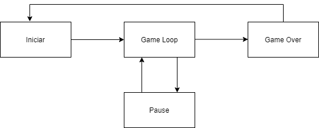

# Dungeons & Itens

Jogo no estilo rogue-like RPG.

## Log de Alterações

| Autor | Descrição da Alteração | Data da alteração |
|:-----:|:----------------------:|:-----------------:|
|   -   |         -              |        -          |
|   -   |         -              |        -          |
|   -   |         -              |        -          |

## Identidade do jogo (Conceito)

Um cavaleiro mediaval muito valente que tem por objetivo destruir todos os monstros que se encontram nas profundezas de uma caverna.

## Descrição da mecânica (Core Mechanics / System design)

O cavaleiro tem por objetivo matar todos os monstros da sala. Os monstros ao serem mortos derrubam no chão uma variedade de armas para o cavaleiro empunhar.

## Características (Mundo do jogo)

 Jogo visto de cima para baixo no estilo dungeon crawl de ação e aventura que usa sprites bidimensionais.

## Arte

Jogo em mundo 2D com mapa criado utilizando Tiles.

## Música/Trilha Sonora

- https://mixkit.co/free-sound-effects/medieval-battle/
- https://mixkit.co/free-sound-effects/sword/

## Interface

Interface simples. Apenas possui alguns paineis para iniciar, pausar e game over.

## Controles

Direcionais do teclado para movimentação do personagem e barra de espaço para atacar.

## Dificuldade

As dificuldades são a grande quantidade de monstros e sua força que cresce a casa sala. O usuário terá que pensar em uma estratégia para não ser cercado pelos monstros e conseguir derrota-los.

## Fluxo do jogo

O cavaleiro derrota os monstro de uma sala e parte para a seguinte. 
Fluxo de telas:

## Personagens

- Cavaleiro medieval da espada de madeira: nosso heroi;
- Caveira guerreira: utiliza um enorme machado, se move lentamente e seu ataques machucam muito.
- Cogumelo assassino: muito lento, mas muito resistente. Muito dificil de derrotar;
- Goblin: pequeno e muito veloz. Muito dificil de se livrar deles.
- Olho voador: consegue te perceber de longe e está sempre atrás de você!

## Cronograma e Escopo

Próximo passo: Construção de salas de forma procedural;

## Definições gerais

- Gênero:
    - Rogue-like RPG.

- Plataformas:
    - Web.

- Público alvo:
    - Jovens que gostam de jogos de fantasia.